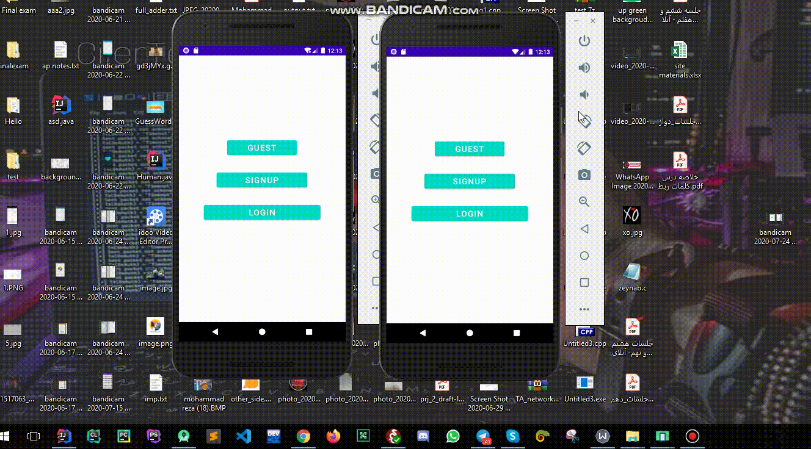

# Why?

    <b>Internet Engineering Course Assignment (Spring 2022)

# Use : 
- HTML 
- CSS
- ReactJS

# Data :

[Local Data](./src/data.json) 

# Find Out How To  :

-  Use Redux

# How To Install?
- `npm install`

# How To Run?
- `npm start`

# Final Result 

  

  

